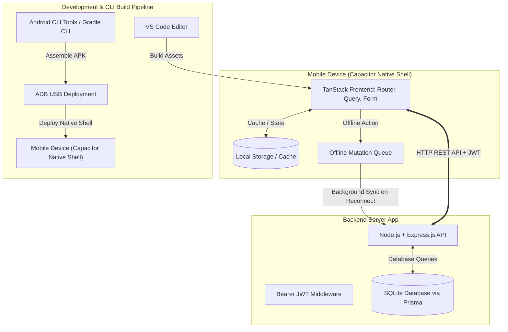

# Technical Specification: Otomos

## 1. Executive Summary & Core Stack
**Otomos** is a friction-free "Commander and Runner" errand management application designed for fast, trusted collaboration among friends.

### Key Objectives
- **Frictionless Onboarding:** No email required; users register with a username and password to receive a unique 7-character friend code (`code7`).
- **Flexible Roles:** Dual-role dynamic where any connected user can act as a Commander (dispatching errands) or a Runner (fulfilling errands).
- **Offline-First Capabilities:** Full optimistic UI updates and local persistence so Runners can check off items off-grid, automatically syncing once connection restores.

### Selected Tech Stack
- **App Name:** Otomos
- **Frontend:** TanStack (Router, Query, Form) wrapped inside a Capacitor Native Shell.
- **Backend:** Node.js + Express.js REST API authenticated with Bearer JWTs.
- **Database:** SQLite managed via Prisma ORM.
- **Mobile Build Toolchain:** Headless Android SDK / Gradle CLI (`sdkmanager`, `gradlew`, `adb`) — **Android Studio skipped**.
- **Offline Engine:** TanStack Query with local persistence (`@tanstack/react-query-persist-client`) & optimistic mutation queues.

---

## 2. System Architecture Diagram

